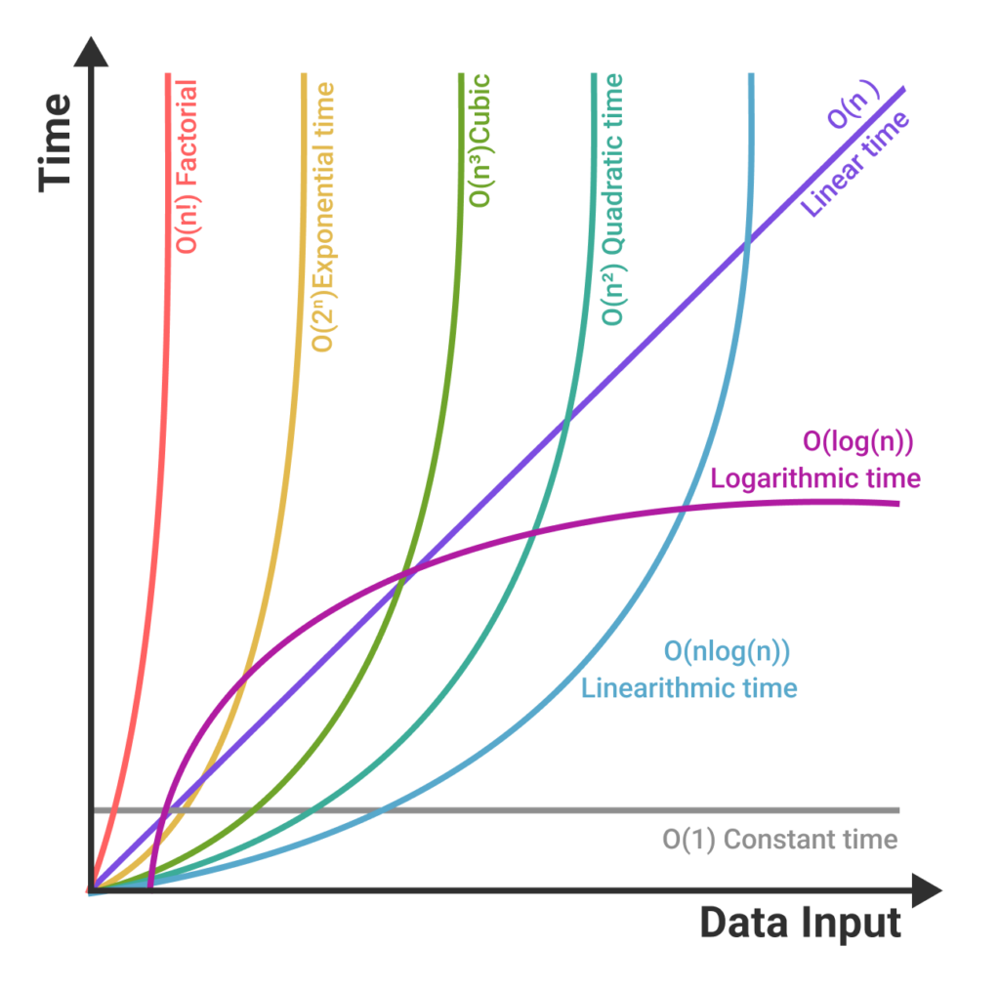

Study One
=========

공부용.

## DATA STRUCTURE

- Linear 선형 자료구조
  - List
    - LinkedList
  - 제한된 선형 자료구조
    - Stack(LIFO)
    - Queue(FIFO)
    - Deque
- 비선형적 자료구조
  - Tree: 1:n
  - Graph: n:m

- 파일구조
  - 순차파일
  - 색인파일
  - 직접파일
- 단순구조
  - 정수
  - 실수
  - 문자
  - 문자열

## 알고리즘
- 정렬
- 탐색

### 알고리즘 분석 기준

- 정확도 correctness
- 단순성 simplicity
- 복잡도 complexity

복잡도만 객관적으로 평가 가능

#### 복잡도 분석 방법
- 시간 복잡도 time complexity
  - 수행 속도 computation time 측면의 복잡도 
- 공간 복잡도 space complexity
  - 기억 장소 사용량 storage requirement 측면의 복잡도

#### O 표기 (Big-oh)
worst case에 대한 알고리즘 복잡도 정의

- 다항식형 알고리즘
  - O(1) : 상수형 알고리즘 < O(log n)
  - O(n) : 선형 알고리즘 < O(nlog n)
  - O(n^2) : 평방형 알고리즘
  - O(n^3) : 입방형 알고리즘
- 지수형 알고리즘
  - O(2^n)
  - O(e^n)

실용성 있는 알고리즘은 O(nlog n)까지
보통 빠른 속도 정렬 알고리즘 수준

