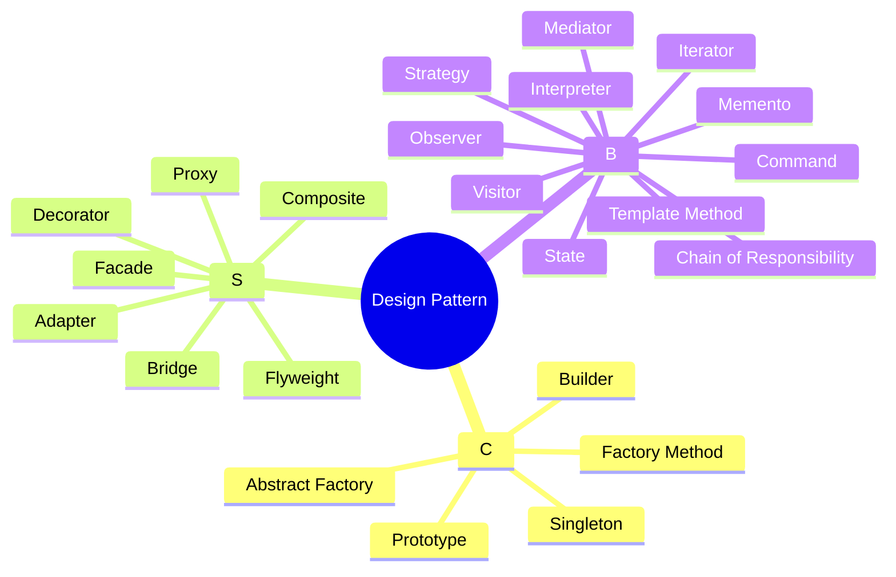

# design-pattern
design pattern

https://www.tutorialspoint.com/design_pattern/design_pattern_quick_guide.htm

- Abstract Factory
- Adapter
- Bridge
- Builder
- Chain of Responsibility
- Command
- Composite
- Decorator
- Facade
- Factory Method
- Flyweight
- Interpreter
- Iterator
- Mediator
- Memento
- Prototype
- Proxy
- Observer
- Singleton
- State
- Strategy
- Template Method
- Visitor

## Adapter

