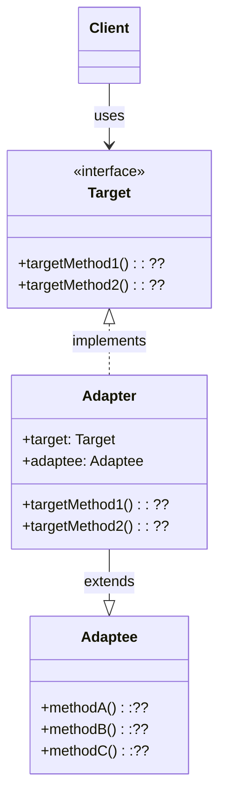
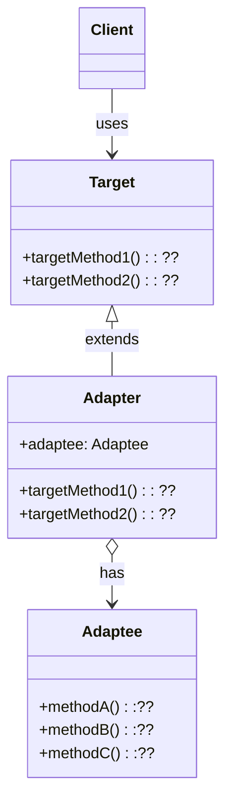
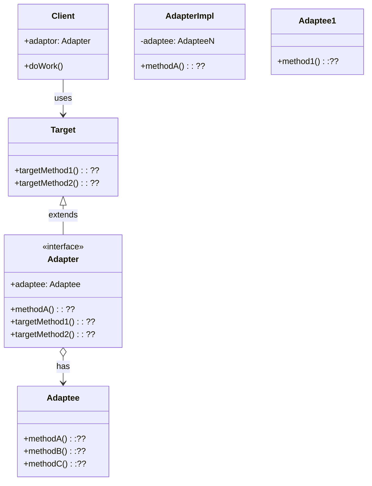

# Adaptor

## Adaptor0

```mermaid
classDiagram
    class Target {
        <<interface>>
        +targetMethod1(): ??
        +targetMethod2(): ??
    }
    class Adapter {
        +target: Target
        +adaptee: Adaptee
        +targetMethod1(): ??
        +targetMethod2(): ??
    }
    class Adaptee {
        +methodA():??
        +methodB():??
        +methodC():??
    }
    Client --> Target : uses
    Target <|.. Adapter : implements
    Adapter --|> Adaptee : extends
```

## Adaptor1

```mermaid
classDiagram
    class Target {
        +targetMethod1(): ??
        +targetMethod2(): ??
    }
    class Adapter {
        +adaptee: Adaptee
        +targetMethod1(): ??
        +targetMethod2(): ??
    }
    class Adaptee {
        +methodA():??
        +methodB():??
        +methodC():??
    }
    Client --> Target: uses
    Target <|-- Adapter: extends
    Adapter o--> Adaptee: has
```

## Adapter2

```mermaid
classDiagram
    class Client {
        +adaptor: Adapter
        +doWork()
    }
    class Adapter {
        <<interface>>
        +methodA(): ??
    }
    class AdapterImpl {
        -adaptee: AdapteeN
        +methodA(): ??
    }
    class Adaptee1 {
        +method1():??
    }
    class Target {
        +targetMethod1(): ??
        +targetMethod2(): ??
    }
    class Adapter {
        +adaptee: Adaptee
        +targetMethod1(): ??
        +targetMethod2(): ??
    }
    class Adaptee {
        +methodA():??
        +methodB():??
        +methodC():??
    }
    Client --> Target: uses
    Target <|-- Adapter: extends
    Adapter o--> Adaptee: has
```

### 유사 패턴
Bridge
Decorator
